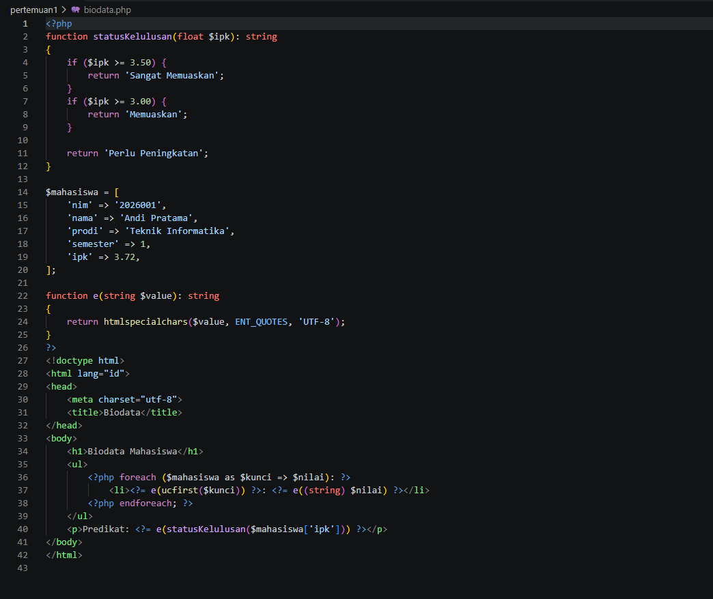
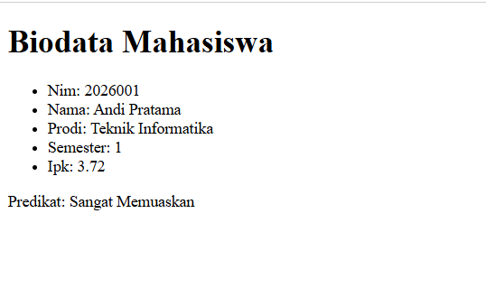
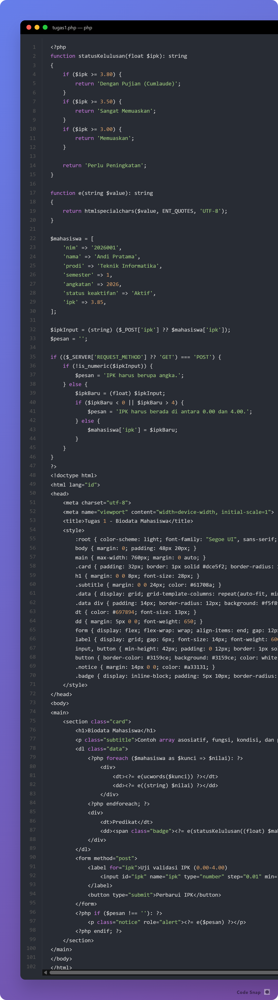
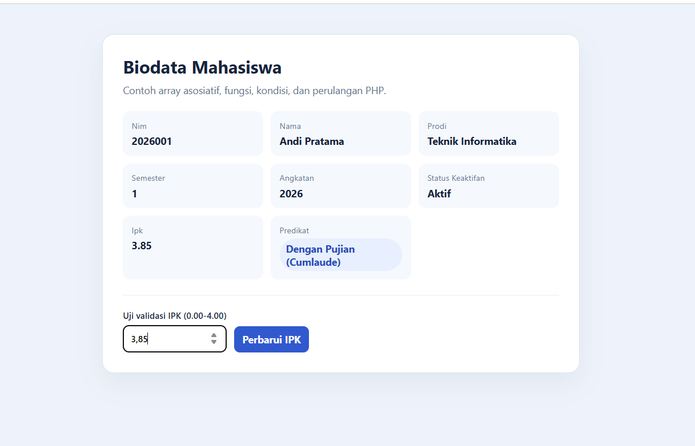

# Tugas 1 - Biodata Mahasiswa

## 1. Modifikasi Program

Contoh pertemuan 1 (`kalkulator.php` dan `biodata.php`) sudah dibuat ulang dan bisa dijalankan. Pada program biodata, dilakukan beberapa modifikasi:

1. **Field baru:** menambahkan `angkatan` dan `status keaktifan` ke array asosiatif mahasiswa.
2. **Kondisi dan validasi baru:** menambahkan predikat Cumlaude untuk IPK minimal 3.80 serta memvalidasi input IPK pada rentang 0.00 sampai 4.00.
3. **Tampilan:** merapikan biodata menjadi kartu dan menyediakan form agar validasi IPK bisa dicoba langsung.

## 2. Penjelasan 5 Bagian Kode Paling Penting

1. `statusKelulusan(float $ipk): string` mengubah nilai IPK menjadi predikat dengan beberapa kondisi berurutan.
2. Array asosiatif `$mahasiswa` menyimpan biodata dalam pasangan nama field dan nilai, sehingga field baru mudah ditambahkan.
3. `foreach ($mahasiswa as $kunci => $nilai)` menampilkan semua field secara dinamis tanpa menulis markup berulang.
4. `is_numeric()` dan pemeriksaan rentang 0 sampai 4 mencegah input IPK yang tidak sesuai sebelum dipakai.
5. `htmlspecialchars(..., ENT_QUOTES, 'UTF-8')` mengubah karakter khusus sebelum data ditampilkan sebagai HTML.

## 3. Screenshot Sebelum dan Sesudah Modifikasi

Screenshot berikut menunjukkan kode awal pada `biodata.php` dan hasil modifikasinya pada `tugas1.php`, beserta tampilan di browser.

### Kode Awal — `biodata.php`



### Tampilan Awal



### Kode Sesudah Modifikasi — `tugas1.php`



### Tampilan Sesudah Modifikasi



## 4. Validasi Input IPK

Form pada `tugas1.php` menerima IPK sebagai input, memeriksa bahwa nilainya angka, lalu memastikan nilainya berada pada rentang 0.00–4.00. Jika tidak valid, halaman menampilkan pesan dan tidak memperbarui biodata.

## Menjalankan Program

Di terminal, dari folder proyek:

```powershell
php -S localhost:8000
```

Buka `http://localhost:8000/pertemuan1/kalkulator.php`, `http://localhost:8000/pertemuan1/biodata.php`, atau `http://localhost:8000/pertemuan1/tugas1.php`.
