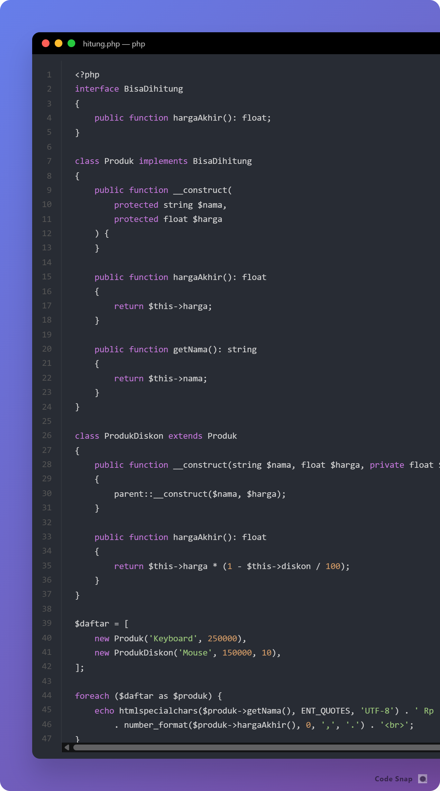
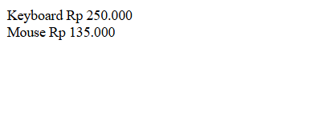
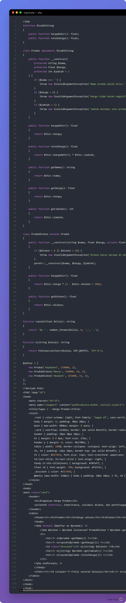
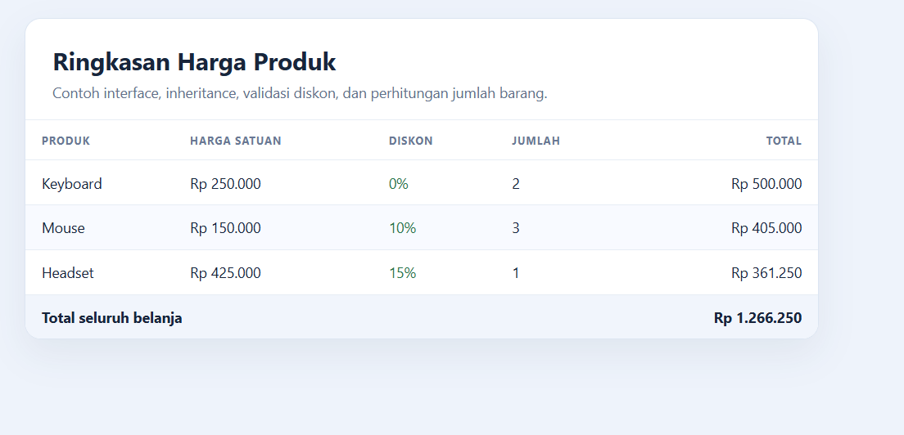

# Tugas 2 - Interface dan Inheritance Produk

## 1. Modifikasi Program

Contoh pertemuan 2 (`identitas.php` dan `hitung.php`) sudah dibuat ulang dan bisa dijalankan. Pada program hitung produk, dilakukan beberapa modifikasi:

1. **Perhitungan jumlah barang:** menambahkan properti jumlah dan menghitung subtotal setiap baris serta total seluruh produk.
2. **Validasi input objek:** memeriksa nama, harga, jumlah, dan diskon (0%-50%) saat objek dibuat agar nilai yang tidak masuk akal ditolak.
3. **Tampilan:** hasil ditampilkan dalam tabel ringkas dengan format Rupiah dan penanda diskon.

## 2. Penjelasan 5 Bagian Kode Paling Penting

1. `interface BisaDihitung` menetapkan kontrak metode harga akhir dan total harga bagi kelas produk.
2. `class Produk implements BisaDihitung` menyediakan harga dasar, jumlah, dan perhitungan total.
3. `class ProdukDiskon extends Produk` mewarisi data produk dan mengganti perhitungan harga akhir dengan potongan harga.
4. `InvalidArgumentException` menghentikan pembuatan objek ketika nama, harga, jumlah, atau diskon berada di luar batas yang ditentukan.
5. `foreach` bersama `instanceof ProdukDiskon` menampilkan semua produk dan membedakan produk diskon tanpa menggandakan kode tabel.

## 3. Screenshot Sebelum dan Sesudah Modifikasi

Screenshot berikut menunjukkan kode awal pada `hitung.php` dan hasil modifikasinya pada `tugas2.php`, beserta tampilan di browser.

### Kode Awal — `hitung.php`



### Tampilan Awal



### Kode Sesudah Modifikasi — `tugas2.php`



### Tampilan Sesudah Modifikasi



## 4. Validasi Data Produk

Konstruktor produk memeriksa nama, harga, jumlah, dan diskon sebelum perhitungan dilakukan. Diskon hanya menerima nilai 0%–50%; nilai di luar rentang tersebut ditolak dengan `InvalidArgumentException`.

## Menjalankan Program

Di terminal, dari folder proyek:

```powershell
php -S localhost:8000
```

Buka `http://localhost:8000/pertemuan2/identitas.php`, `http://localhost:8000/pertemuan2/hitung.php`, atau `http://localhost:8000/pertemuan2/tugas2.php`.
